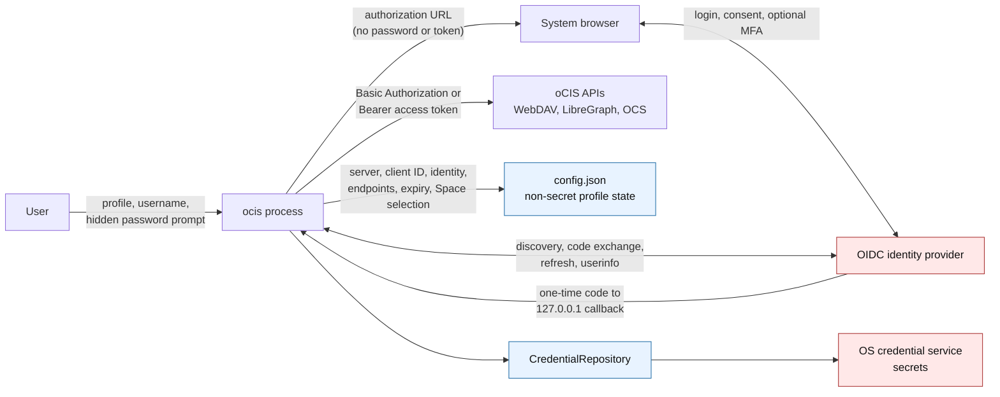
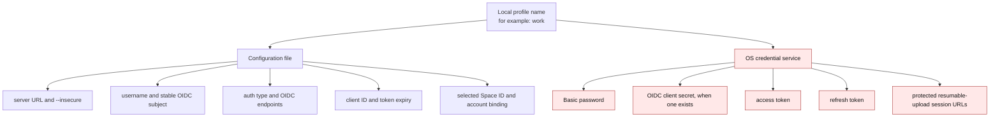
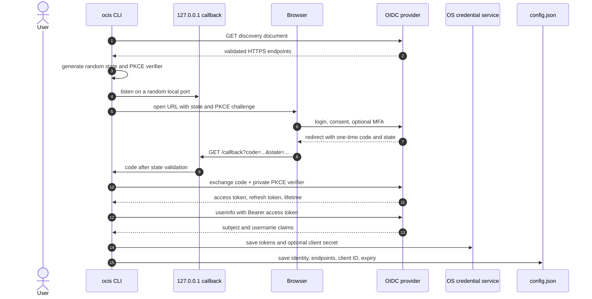
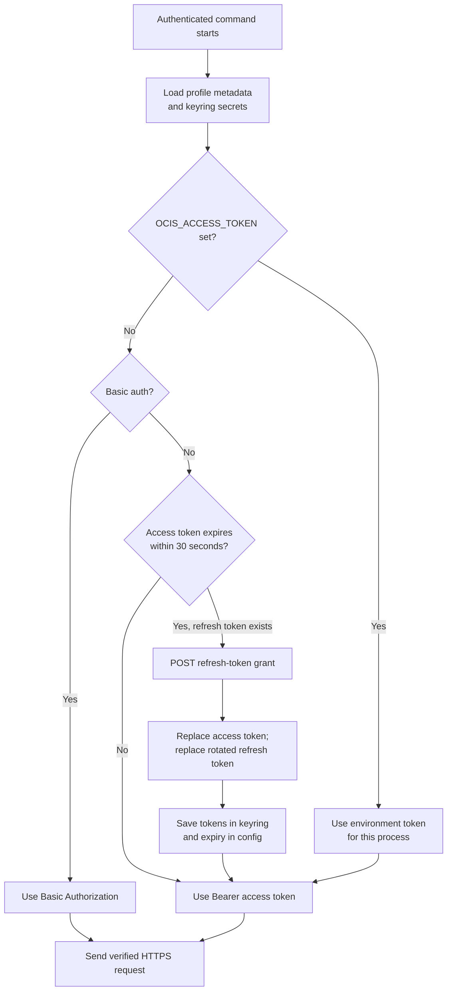
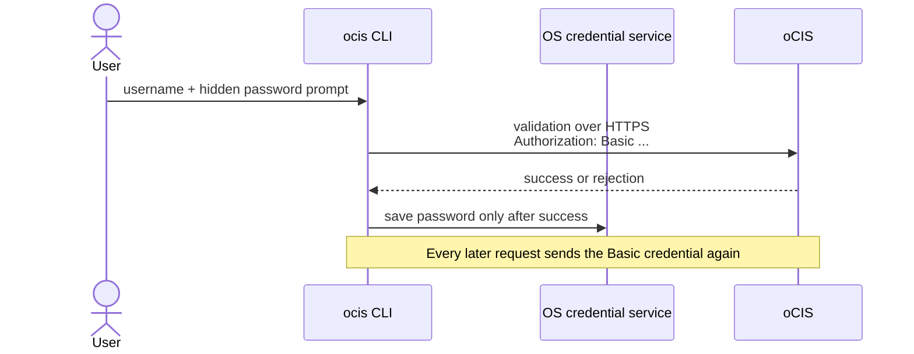
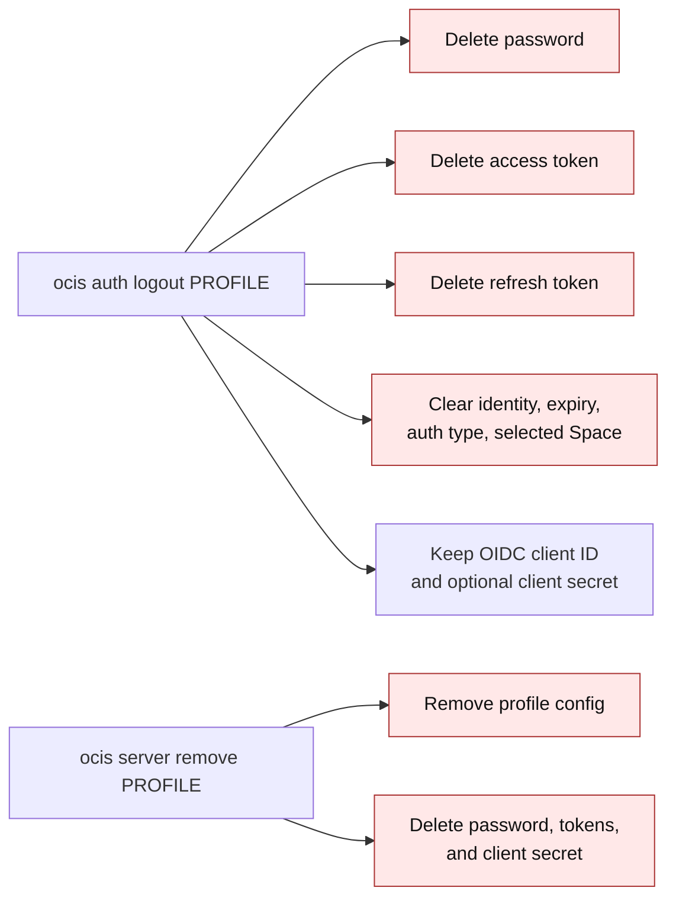

# Authentication and credential storage

This document describes how this CLI authenticates, where it saves state, and
where credentials can still be exposed. The operating system and the oCIS
deployment are part of the trust boundary: no CLI can protect credentials from
a compromised user session, a sufficiently privileged local administrator, or
a server that receives them.

## At a glance



The regular configuration file never contains a password, client secret,
access token, or refresh token. Those values are stored through the operating
system's credential service and loaded into the `ocis` process only while a
command needs them.

## Profiles and the two local stores

`--profile NAME` selects a local CLI profile. It does not query oCIS and it is
not a server-side role. A profile connects one local name to one server and one
authenticated account. `ocis server use NAME` changes the local default so
`--profile` can normally be omitted.



The configuration path comes from Go's `os.UserConfigDir`, unless
`OCIS_CONFIG` overrides it:

| Platform | Typical configuration path |
| --- | --- |
| macOS | `~/Library/Application Support/ocis-cli/config.json` |
| Linux | `$XDG_CONFIG_HOME/ocis-cli/config.json`, or `~/.config/ocis-cli/config.json` |
| Windows | `%AppData%\ocis-cli\config.json` |

The configuration directory and file are created with owner-only permissions
on platforms that enforce POSIX permission bits. Writes are atomic: the CLI
writes an owner-only temporary file and renames it over `config.json`.
`OCIS_CONFIG` changes only this non-secret path; it does not move secrets out
of the OS credential service.

The non-secret file contains:

- the schema version and current profile name;
- server URL, TLS setting, username, stable OIDC subject, and auth type;
- public OIDC client ID, issuer, token endpoint, and userinfo endpoint;
- access-token expiry time; and
- selected Space state bound to the authenticated identity.

`Password`, `ClientSecret`, `AccessToken`, and `RefreshToken` are explicitly
excluded from JSON serialization. The CLI has no plaintext-secret migration
or fallback path. If the credential service is locked or unavailable, the
command fails.

## Which keyring is used?

The production adapter uses `github.com/zalando/go-keyring`, which maps the
same repository interface to each platform:

| Platform | Credential service used | Practical behavior |
| --- | --- | --- |
| macOS | macOS Keychain, through the `security` tool | Items are protected by the user's keychain. macOS may require it to be unlocked or show an access prompt. |
| Linux and BSD | Secret Service API over the user's session D-Bus | A provider such as GNOME Keyring or KWallet must expose an unlocked collection. Headless sessions need a Secret Service provider and session bus. |
| Windows | Windows Credential Manager | Items are protected for the Windows user by the operating system. |

The keyring account name is the local profile name. Values are split into
separate items to avoid per-item size limits, especially on Windows:

| Credential-service item | Value |
| --- | --- |
| `io.github.mzner.ocis-cli.password` | Basic-auth password |
| `io.github.mzner.ocis-cli.client-secret` | OIDC client secret, if issued |
| `io.github.mzner.ocis-cli.access-token` | OAuth access token |
| `io.github.mzner.ocis-cli.refresh-token` | OAuth refresh token |
| `io.github.mzner.ocis-cli.format` | Storage-format marker, currently `2` |
| `io.github.mzner.ocis-cli.upload-session` | Per-upload protected TUS resume state |

This is the initial public keyring format. The CLI does not read or convert
earlier development-only credential layouts.

Completed, expired, or invalid TUS upload sessions are removed as normal
transfer lifecycle cleanup. A resume URL is secret because it may contain a
transfer token.

An OS credential service is safer than plaintext configuration, but it is not
a hardware security boundary. Same-user malware, an unlocked session,
root/administrator access, a debugger, or a compromised keyring provider may
still obtain secrets.

## OIDC setup

OIDC is the default authentication mode. Setup and login are separate so the
server can establish a client registration before a person authenticates:

```sh
ocis server add work https://cloud.example.com
ocis auth setup work
ocis auth login work
```

`auth setup` fetches `/.well-known/openid-configuration`. Every discovered
issuer and endpoint must be an absolute HTTP(S) URL. HTTPS is required unless
the profile explicitly uses `--insecure`.

If discovery advertises dynamic registration, the CLI registers an untrusted
native client with:

- loopback redirect `http://127.0.0.1`;
- authorization-code and refresh-token grants;
- Authorization Code response type; and
- client name `oCIS CLI`.

The returned client ID is public and is written to `config.json`. A returned
client secret is written to the keyring. If dynamic registration is not
advertised, `auth setup` prints the native-client entry that the server
administrator must add. The static public client ID is
`github.com/mzner/ocis-cli`; its empty secret is intentional. PKCE protects the
authorization-code flow for this public native client.

Running `auth setup` clears the current account login and selected Space, but
keeps the newly established client registration.

## OIDC login: Authorization Code + PKCE



Important properties:

- `state` prevents accepting a callback started by another login attempt.
- The random PKCE verifier stays in process memory. Only its SHA-256 challenge
  appears in the browser URL.
- The callback listens only on `127.0.0.1`, uses a random port, and waits for
  at most five minutes.
- The browser URL contains the public client ID, redirect URI, scopes, state,
  and PKCE challenge. It does not contain the password, PKCE verifier, access
  token, refresh token, or client secret.
- The authorization code is short-lived and exchanged directly with the token
  endpoint.
- The requested scopes are `openid offline_access profile email`.
- If login returns no positive token lifetime, the CLI assumes one hour.

The browser and identity provider own the username/password form, consent, and
second-factor interaction. The CLI never receives the password entered in the
OIDC browser.

### MFA

`ocis auth login PROFILE --mfa` asks for step-up authentication. By default,
the CLI reads the first advertised MFA authentication-context value from the
server's OCS capabilities and sends it as OIDC `acr_values`.
`--mfa --acr VALUE` supplies a deployment-specific value explicitly. The
server and identity provider decide whether MFA is enabled, required, and
satisfied; the CLI cannot manufacture proof of MFA. Basic auth cannot perform
this OIDC step-up.

## Token use and refresh



An access token is a bearer credential: possession is enough to exercise its
authority until it expires or is revoked. The CLI stores it in the keyring and
sends it in `Authorization: Bearer ...` for WebDAV, LibreGraph, OCS, TUS, and
OIDC userinfo requests.

Before an OIDC command, the CLI refreshes when the stored access token expires
within 30 seconds and a refresh token is available. The token endpoint receives
the refresh token, public client ID, and client secret when the registration
has one. A rotated refresh token replaces the old one. Updated tokens are saved
to the keyring before the non-secret expiry is saved to configuration.

`OCIS_ACCESS_TOKEN` is an explicit one-process override. It replaces the
profile access token in memory and is not saved by that override path. Treat
environment variables as secrets: they may be inherited by child processes,
captured by CI, included in shell history, or visible to local diagnostics,
depending on the operating system and launch method.

## Basic authentication



For Basic auth, the username is non-secret configuration and the password is a
keyring secret. Interactive input uses a hidden terminal prompt; there is no
password-value flag. Non-interactive use may provide `OCIS_PASSWORD`, with the
environment-variable risks described above.

HTTP Basic encoding is only Base64; it is not encryption. The password is sent
to the server on every authenticated request and is safe in transit only when
TLS is used and its certificate is verified. OIDC is preferred because normal
API requests send a limited-lifetime access token instead of the account
password.

Passwords used by `admin user create` or `admin user update --set-password` are
separate. They come from a hidden prompt or `OCIS_USER_PASSWORD`, exist in
memory for that request, and are sent to the authorized administration
endpoint over HTTPS. They are not saved as the profile password or included in
normal or structured output.

## When can a secret be exposed?

No implementation can promise that a credential is never exposed. This CLI
reduces exposure as follows:

| Boundary | What happens | Risk and guidance |
| --- | --- | --- |
| Command line | Passwords, tokens, and client secrets have no value flags. | Avoid putting secrets in arguments, which commonly appear in shell history and process listings. |
| Hidden prompt | Basic and administrative passwords are read without terminal echo. | The value still exists briefly in process memory. |
| Environment | `OCIS_PASSWORD`, `OCIS_USER_PASSWORD`, `OCIS_CLIENT_SECRET`, and `OCIS_ACCESS_TOKEN` are supported where applicable. | Prefer a prompt or protected CI secret injection. Never echo the environment or persist assignments in history. |
| Browser | OIDC password and MFA stay between the browser and identity provider. | Verify the identity-provider origin before entering credentials. |
| Process memory | Active passwords/tokens are loaded while a command runs. PKCE state, verifier, and code are memory-only. | Same-user malware, a debugger, core dump, or privileged process may read memory. |
| Local disk | Only non-secret profile metadata is in `config.json`. | Server URLs and usernames are not secrets, but may still be private metadata. |
| OS keyring | Authentication material and TUS resume URLs are stored by the platform service. | Protection depends on a trustworthy, unlocked OS session and provider. |
| Network | Basic credentials or bearer tokens are HTTP authorization headers. OAuth credentials go to the token endpoint. | Use verified HTTPS. Never use `--insecure` outside a trusted development environment. |
| Server | oCIS or its IdP validates credentials and receives tokens or Basic credentials. | A malicious or compromised server can misuse credentials sent to it. |
| Output and logs | Status/JSON report metadata, not secrets. Retry logs exclude authorization headers and request bodies. | Server-controlled error text can be unexpected; review output before publishing it. |

`--insecure` disables TLS certificate verification for the profile and is also
the only way to accept a cleartext `http://` server URL. Without it, a server
URL must use `https`, because every authenticated request carries a Basic
password or bearer token and cleartext would expose it to anyone on the network
path.

The requirement covers a stored URL, not just a newly entered one: a profile
saved by an earlier release is re-checked when it is selected, before
`OCIS_ACCESS_TOKEN` is applied, a token is refreshed, or an authenticated
request is sent. Profile loading may already have read its secret from the
keyring into process memory, but the rejected URL cannot receive it. A rejected
profile stays inspectable and repairable with `server list`, `status`, `logout`,
and `server remove`, and is never migrated to `insecure` automatically.
Redirects are checked too: an `https` endpoint that redirects to `http://`, even
on the same host, is refused rather than followed, because Go decides whether
to forward the `Authorization` header by comparing hostnames alone.

With `--insecure`, traffic may still be encrypted, but an active attacker can
impersonate the server or identity provider and steal passwords, authorization
codes, client secrets, or tokens. Use it only for a development server whose
network path you trust.

## Logout, removal, and revocation



`auth logout` is local logout. It removes the account password/tokens and
account-specific state. It keeps the OIDC client registration so the same
profile can log in again. It currently does not call a token-revocation or
end-session endpoint, so a copied token may remain valid until server expiry
or revocation.

`server remove` removes the profile and its four authentication credential
items, including the client secret. Protected TUS sessions are normally
deleted when an upload completes or when the CLI detects that a session is
expired or invalid.

Deleting local state does not delete a user account, revoke a role, remove a
server-side OIDC client registration, or terminate a browser/IdP session.
Those are server administration operations.

## Failure behavior

- A locked or unavailable credential service fails the command. Secrets are
  not written to `config.json` as a fallback.
- Missing Basic credentials or missing OIDC access/refresh tokens require a
  new login.
- A rejected refresh fails; the CLI does not switch accounts or profiles.
- Changing identity clears a selected Space owned by the previous account.
  Logout also clears it.
- OIDC discovery rejects non-HTTP(S) endpoint schemes before an authorization
  URL reaches the operating system browser launcher.
- Cancellation propagates through discovery, token, userinfo, validation, and
  API requests.

Useful non-secret diagnostics:

```sh
ocis server list
ocis auth status PROFILE
ocis doctor PROFILE
```

These report profile and authentication state, never credential values.

## Code map

| Responsibility | Package or file |
| --- | --- |
| Cobra auth flags | `internal/command/auth.go` |
| Login, logout, PKCE callback, MFA | `internal/app/auth_service.go` |
| Dynamic/static OIDC client setup | `internal/app/auth_setup_service.go` |
| Credential loading and token refresh | `internal/app/runtime.go` |
| OIDC protocol operations | `internal/auth/` |
| Atomic non-secret profile storage | `internal/config/store.go` |
| OS keyring adapter | `internal/credentials/store.go` |
| Protected TUS resume state | `internal/credentials/upload_session.go` |
| Authenticated HTTP headers | `internal/httpapi/client.go`, `internal/webdav/client.go`, `internal/webdav/tus.go` |
